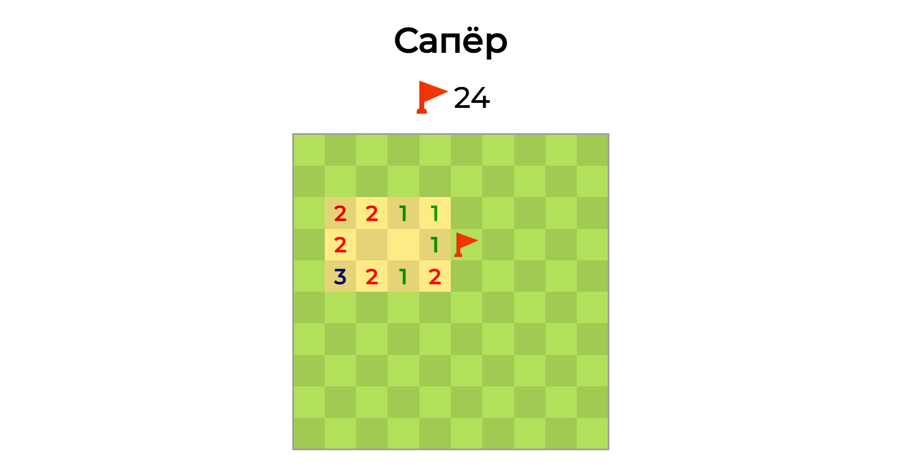

# Super Game



## Description
Super Game is an engaging game that allows players to customize their experience by increasing the game field size, adjusting the number of bombs, and more. The game is written in pure JavaScript, utilizing a design pattern that separates game logic from rendering components for improved maintainability and scalability.

## Features
- Customizable Game Field: Players can increase the size of the game board to enhance gameplay.
- Adjustable Bomb Count: Players can modify the number of bombs, adding an extra layer of challenge.
- Separation of Concerns: The game employs a design pattern that differentiates between game logic and rendering, making it easier to manage and update.
- Interactive Gameplay: Engaging mechanics that keep players entertained.


## Technologies
- HTML: Structure of the game interface.
- CSS: Styling to create an appealing visual experience.
- JavaScript: Main logic for game functionality, handling user interactions, and rendering.

## Installation
1. Clone the repository:
    ```bash
    git clone https://github.com/yourusername/super-game.git
    ```

2. Navigate to the project directory:
    ```bash
    cd super-game
    ```
3. Open the index.html file in your web browser.

## Usage
Start the game by opening the application in a web browser.
Customize the game field size and the number of bombs using the provided controls.
Enjoy the gameplay and strive for high scores!